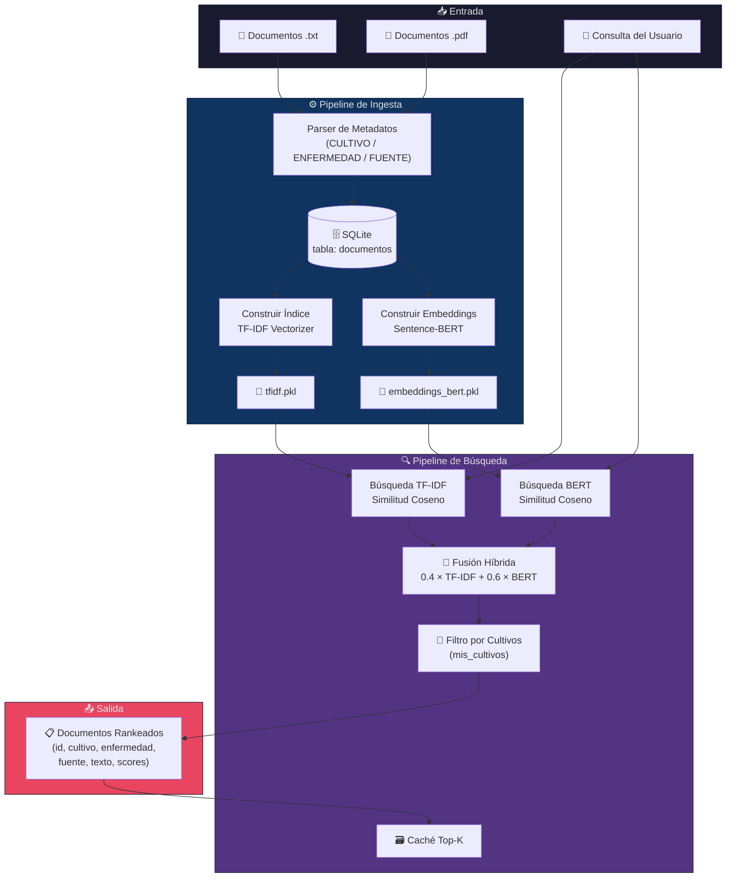
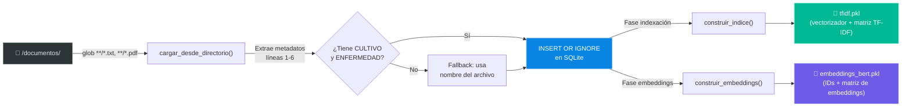
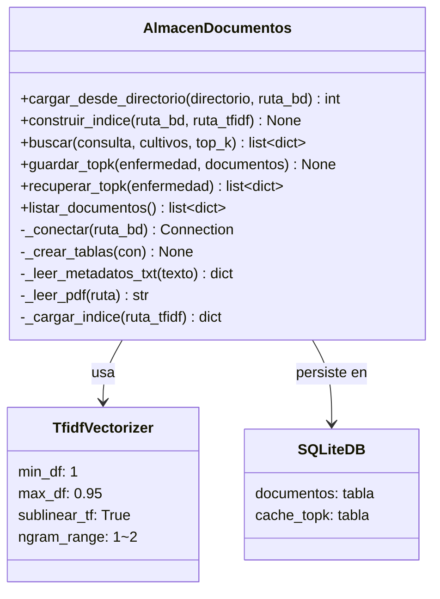
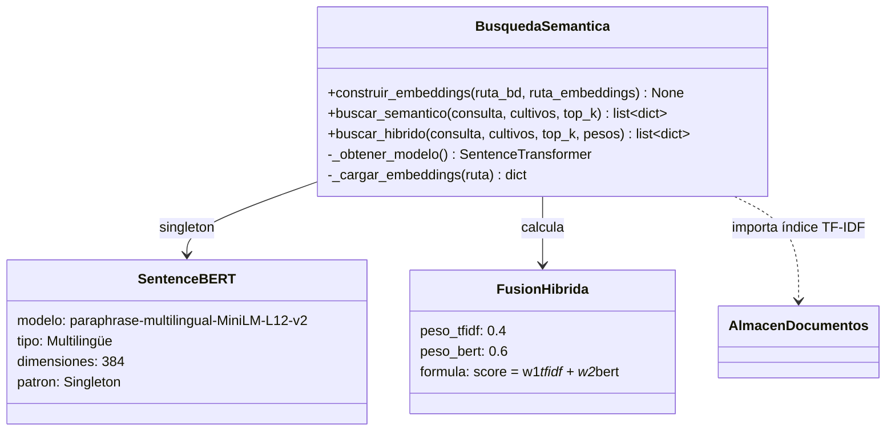
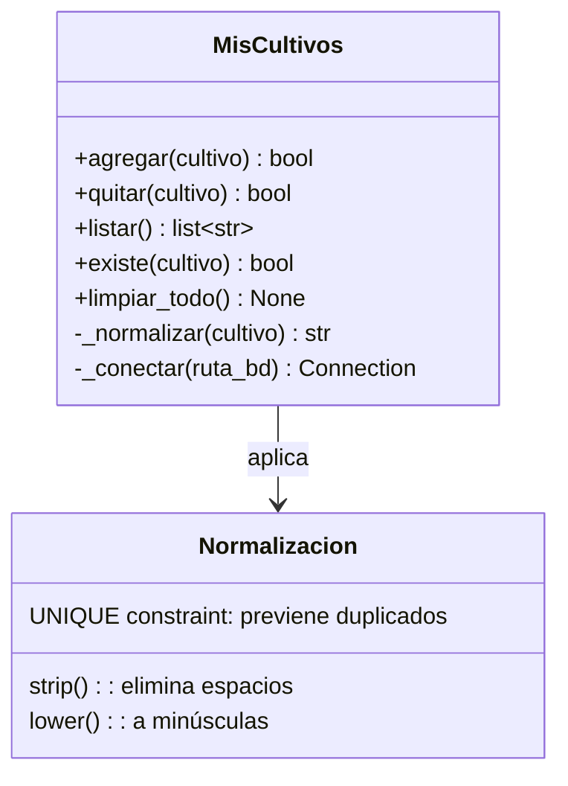
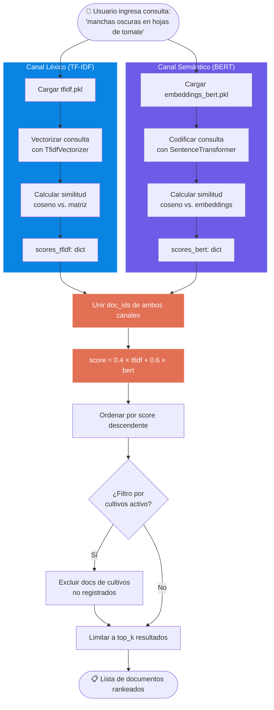
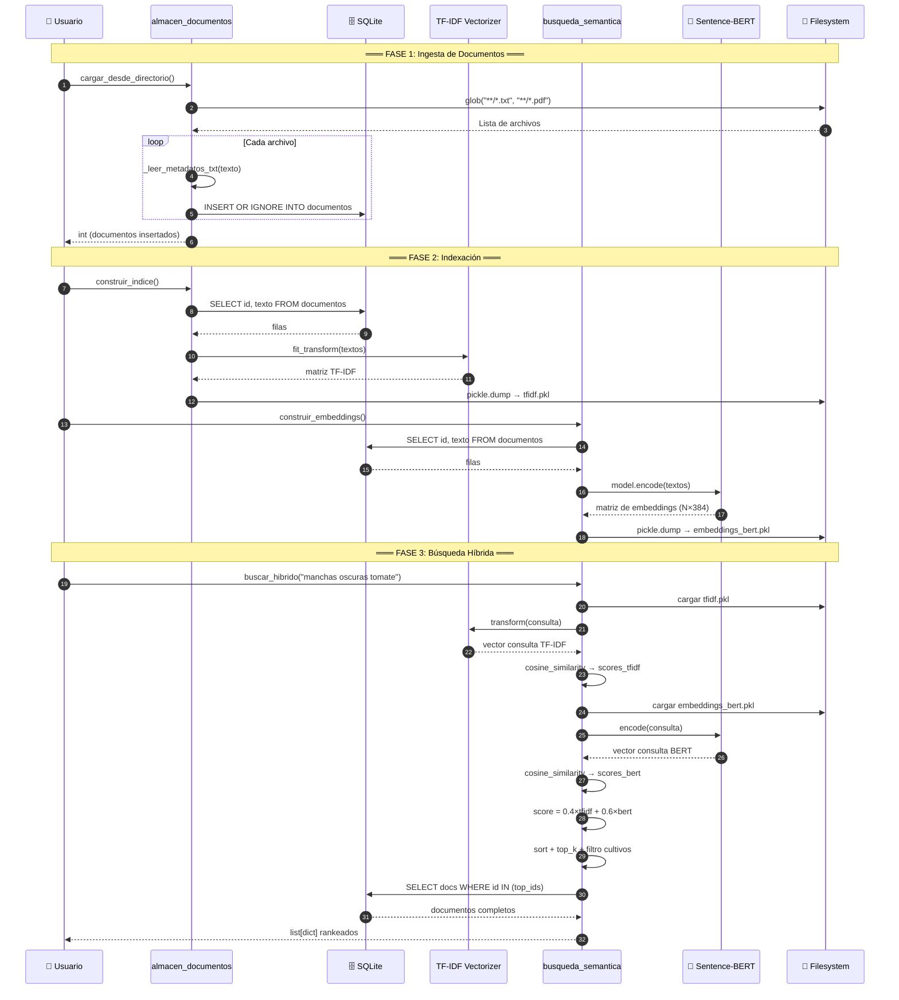
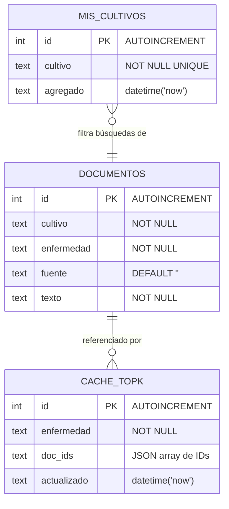
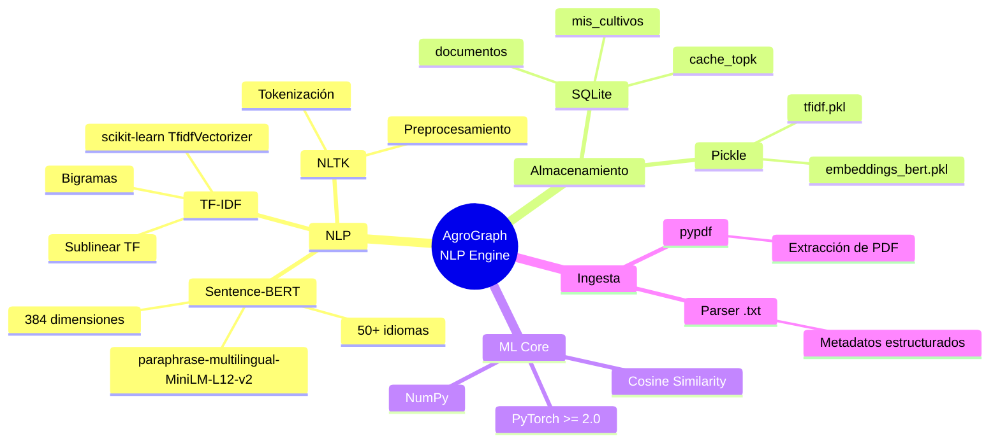

<div align="center">

<!-- BANNER -->


<br/><br/>

# 🌾 LLM-NLP-AgroGraph-IA

### Motor de Búsqueda Semántica e Híbrida para Diagnóstico Fitosanitario

<p>
Sistema de <b>Minería de Texto</b> y <b>NLP</b> que combina <b>TF-IDF</b> (búsqueda léxica) con <b>Sentence-BERT</b> (búsqueda semántica) para recuperar documentos fitosanitarios relevantes a partir de descripciones de síntomas en cultivos agrícolas.
</p>

<br/>

| Componente | Tecnología | Propósito |
|:---:|:---:|:---|
| 📄 Almacén de Documentos | SQLite + TF-IDF | Ingesta, indexación y búsqueda léxica |
| 🧠 Búsqueda Semántica | Sentence-BERT | Comprensión del significado de la consulta |
| 🔀 Búsqueda Híbrida | TF-IDF + BERT | Fusión ponderada de ambos enfoques |
| 🌱 Gestión de Cultivos | SQLite | Configuración local de la parcela del usuario |
| 🗃️ Caché Top-K | SQLite | Resultados pre-calculados por enfermedad |

</div>

---

## 📑 Tabla de Contenidos

- [Visión General](#-visión-general)
- [Arquitectura del Sistema](#-arquitectura-del-sistema)
- [Pipeline de Datos](#-pipeline-de-datos)
- [Módulos del Sistema](#-módulos-del-sistema)
  - [almacen_documentos.py](#-almacen_documentospy)
  - [busqueda_semantica.py](#-busqueda_semanticapy)
  - [mis_cultivos.py](#-mis_cultivospy)
- [Flujo de Búsqueda Híbrida](#-flujo-de-búsqueda-híbrida)
- [Diagrama de Secuencia](#-diagrama-de-secuencia)
- [Modelo de Datos](#-modelo-de-datos)
- [Estructura del Proyecto](#-estructura-del-proyecto)
- [Instalación y Uso](#-instalación-y-uso)
- [Tests](#-tests)
- [Stack Tecnológico](#-stack-tecnológico)

---

## 🔭 Visión General

**LLM-NLP-AgroGraph-IA** es el módulo de **Recuperación de Información (IR)** del ecosistema AgroGraph-MAS. Su objetivo principal es responder a la pregunta:

> *"Mi cultivo tiene [síntomas]. ¿Qué enfermedad podría ser y cómo la trato?"*

El sistema **no clasifica imágenes** (eso lo hace el módulo CNN del proyecto principal); en cambio, recibe un **diagnóstico textual** (nombre de enfermedad o descripción de síntomas) y recupera los documentos fitosanitarios más relevantes de una base de conocimiento local.

### ¿Por qué dos métodos de búsqueda?

| Método | Fortaleza | Debilidad |
|:---|:---|:---|
| **TF-IDF** (léxico) | Encuentra coincidencias exactas de términos técnicos | No entiende sinónimos ni paráfrasis |
| **Sentence-BERT** (semántico) | Comprende el *significado* de la consulta | Puede perder términos técnicos específicos |
| **Híbrido** (fusión) | Combina ambas fortalezas | — |

**Ejemplo:** La consulta *"polvo blanco harinoso en las hojas"* no menciona la palabra "oídio", pero el modelo semántico comprende que describe esa enfermedad y la posiciona en los resultados.

---

## 🏗️ Arquitectura del Sistema



---

## 📊 Pipeline de Datos

### Fase 1 — Ingesta y Pre-procesamiento



### Formato de los Documentos Fuente

Cada archivo `.txt` sigue esta estructura estandarizada:

```
CULTIVO: tomate
ENFERMEDAD: tizón tardío
FUENTE: Manual Fitosanitario SAGARPA 2019

DESCRIPCIÓN
[Texto descriptivo de la enfermedad...]

SÍNTOMAS
- [Lista de síntomas observables...]

CONDICIONES FAVORABLES
- [Factores ambientales que propician la enfermedad...]

TRATAMIENTO
1. [Pasos de tratamiento con productos y dosis...]

PREVENCIÓN
- [Medidas preventivas...]

PRODUCTOS RECOMENDADOS
- [Lista de productos comerciales...]
```

---

## 📦 Módulos del Sistema

### 📄 `almacen_documentos.py`

> **Responsabilidad:** Gestión del almacén de documentos fitosanitarios con SQLite + TF-IDF + Caché Top-K.



#### Funciones clave

| Función | Descripción | Entrada | Salida |
|:---|:---|:---|:---|
| `cargar_desde_directorio()` | Parsea `.txt`/`.pdf`, extrae metadatos e inserta en SQLite | directorio, ruta_bd | `int` (docs insertados) |
| `construir_indice()` | Vectoriza textos con TF-IDF y serializa con pickle | ruta_bd, ruta_tfidf | `tfidf.pkl` en disco |
| `buscar()` | Vectoriza consulta, calcula similitud coseno, rankea | consulta, cultivos, top_k | `list[dict]` con scores |
| `guardar_topk()` | Almacena IDs de los mejores docs por enfermedad | enfermedad, docs | Escribe en `cache_topk` |
| `recuperar_topk()` | Recupera docs cacheados sin recalcular | enfermedad | `list[dict]` |

#### Parámetros del TF-IDF Vectorizer

```python
TfidfVectorizer(
    min_df=1,        # Incluir términos que aparezcan en al menos 1 documento
    max_df=0.95,     # Excluir términos en más del 95% de documentos (stop words)
    sublinear_tf=True,  # Aplicar 1 + log(tf) para suavizar frecuencias altas
    ngram_range=(1, 2),  # Unigramas y bigramas ("mancha", "mancha foliar")
)
```

---

### 🧠 `busqueda_semantica.py`

> **Responsabilidad:** Búsqueda semántica con Sentence-BERT y fusión híbrida (TF-IDF + BERT).



#### Modelo Sentence-BERT

| Propiedad | Valor |
|:---|:---|
| **Nombre** | `paraphrase-multilingual-MiniLM-L12-v2` |
| **Idiomas** | 50+ (incluye español) |
| **Dimensiones del embedding** | 384 |
| **Patrón de carga** | Singleton (se carga una sola vez en memoria) |
| **Uso** | Codifica documentos y consultas al mismo espacio vectorial |

#### Fórmula de Fusión Híbrida

```
score_híbrido = 0.4 × score_tfidf + 0.6 × score_bert
```

El peso mayor para BERT (0.6) refleja que la comprensión semántica es más valiosa que la coincidencia léxica para consultas en lenguaje natural agrícola.

---

### 🌱 `mis_cultivos.py`

> **Responsabilidad:** Gestión de la parcela del usuario (lista de cultivos para filtrado personalizado).



Este módulo permite al usuario registrar qué cultivos tiene en su parcela. Esos nombres se usan como **filtro** en las búsquedas: si el usuario solo tiene maíz y calabaza, los resultados de tomate se excluyen automáticamente.

---

## 🔀 Flujo de Búsqueda Híbrida



---

## 🔄 Diagrama de Secuencia

### Flujo completo: Ingesta → Indexación → Búsqueda



---

## 🗄️ Modelo de Datos



### Constraints importantes

- `DOCUMENTOS` tiene un `UNIQUE(cultivo, enfermedad, fuente)` para evitar duplicados.
- `MIS_CULTIVOS` tiene `UNIQUE(cultivo)` y normalización a minúsculas.
- `CACHE_TOPK.doc_ids` almacena un JSON array: `[1, 3, 5]`.

---

## 📂 Estructura del Proyecto

```
LLM-NLP-AgroGraph-IA/
│
├── 📁 documentos/                    # Corpus de conocimiento fitosanitario
│   ├── mancha_foliar_maiz.txt        #   Maíz — Mancha foliar de turcicum
│   ├── oidio_calabaza.txt            #   Calabaza — Oídio (cenicilla)
│   └── tizon_tardio_tomate.txt       #   Tomate — Tizón tardío
│
├── 📁 datos/                         # Artefactos generados (gitignored)
│   ├── almacen.db                    #   Base de datos SQLite
│   ├── tfidf.pkl                     #   Índice TF-IDF serializado
│   └── embeddings_bert.pkl           #   Embeddings Sentence-BERT
│
├── 📁 modulos/                       # Código fuente principal
│   ├── __init__.py
│   ├── almacen_documentos.py         #   Ingesta, TF-IDF, caché Top-K
│   ├── busqueda_semantica.py         #   BERT semántico + fusión híbrida
│   └── mis_cultivos.py               #   Gestión de parcela del usuario
│
├── 📁 tests/                         # Suite de pruebas
│   ├── __init__.py
│   ├── test_almacen.py               #   6 tests: carga, índice, búsqueda, caché
│   ├── test_busqueda_semantica.py    #   4 tests: semántico, híbrido, filtro, pesos
│   └── test_mis_cultivos.py          #   6 tests: CRUD, normalización, limpieza
│
├── requirements.txt                  # Dependencias Python
└── .gitignore
```

---

## 🚀 Instalación y Uso

### Requisitos previos

- **Python 3.10+**
- **pip** (gestor de paquetes)

### 1. Clonar el repositorio

```bash
git clone https://github.com/wilber023/LLM-NLP-AgroGraph-IA.git
cd LLM-NLP-AgroGraph-IA
```

### 2. Crear entorno virtual e instalar dependencias

```bash
python -m venv venv
source venv/bin/activate        # Linux/Mac
# venv\Scripts\activate         # Windows

pip install -r requirements.txt
```

### 3. Pipeline completo

```python
from modulos.almacen_documentos import cargar_desde_directorio, construir_indice
from modulos.busqueda_semantica import construir_embeddings, buscar_hibrido
from modulos.mis_cultivos import agregar

# ── Paso 1: Ingestar documentos ──
n = cargar_desde_directorio()
print(f"Documentos cargados: {n}")

# ── Paso 2: Construir índices ──
construir_indice()           # TF-IDF
construir_embeddings()       # Sentence-BERT (descarga modelo ~120 MB la primera vez)

# ── Paso 3: Configurar parcela (opcional) ──
agregar("tomate")
agregar("maíz")

# ── Paso 4: Buscar ──
resultados = buscar_hibrido(
    "manchas oscuras en hojas de tomate",
    cultivos=["tomate"],
    top_k=3,
)

for r in resultados:
    print(f"[{r['score_hibrido']:.4f}] {r['cultivo']} — {r['enfermedad']}")
    # [0.7823] tomate — tizón tardío
```

---

## 🧪 Tests

El proyecto incluye **16 tests** organizados por módulo:

```bash
# Ejecutar tests individualmente
python -m tests.test_almacen              # 6 tests
python -m tests.test_busqueda_semantica   # 4 tests
python -m tests.test_mis_cultivos         # 6 tests
```

| Test | Verifica |
|:---|:---|
| Carga de documentos | Parser de `.txt`, inserción en SQLite, deduplicación |
| Índice TF-IDF | Creación correcta del vectorizador y serialización |
| Búsqueda léxica | Ranking por similitud coseno, filtro por cultivo |
| Caché Top-K | Guardar y recuperar resultados pre-calculados |
| Búsqueda semántica | BERT encuentra "oídio" sin mencionar la palabra |
| Búsqueda híbrida | Fusión ponderada devuelve el resultado correcto |
| Fórmula híbrida | `score = 0.4×tfidf + 0.6×bert` se cumple |
| Gestión de cultivos | CRUD, normalización, UNIQUE constraint |

---

## 🛠️ Stack Tecnológico

<div align="center">



</div>

---

## 📐 Decisiones de Diseño

### ¿Por qué Sentence-BERT y no un LLM completo para la búsqueda?

| Criterio | Sentence-BERT (MiniLM) | LLM (GPT/Llama) |
|:---|:---|:---|
| **Latencia** | ~5 ms por consulta | ~500-2000 ms |
| **Memoria** | ~120 MB | 4-16 GB |
| **Offline** | ✅ Funciona sin internet | ❌ Requiere API o GPU |
| **Calidad semántica** | Buena para IR | Excelente pero excesiva |

### ¿Por qué fusión híbrida y no solo BERT?

- **TF-IDF** captura términos técnicos exactos (ej. "Phytophthora infestans")
- **BERT** captura semántica (ej. "polvo blanco" → oídio)
- La **fusión 40/60** da prioridad a la comprensión semántica pero no ignora coincidencias léxicas exactas

### ¿Por qué SQLite y no Postgres/MongoDB?

- El sistema está diseñado para funcionar **embebido** en la app móvil AgroGraph-MAS
- **Zero-config**: no requiere servidor de base de datos
- Suficiente para el volumen de documentos fitosanitarios (~cientos)

---

<div align="center">

### Desarrollado como parte del ecosistema AgroGraph-MAS


<br/><br/>

*Motor de NLP para diagnóstico fitosanitario inteligente* 🌾🧠

</div>
